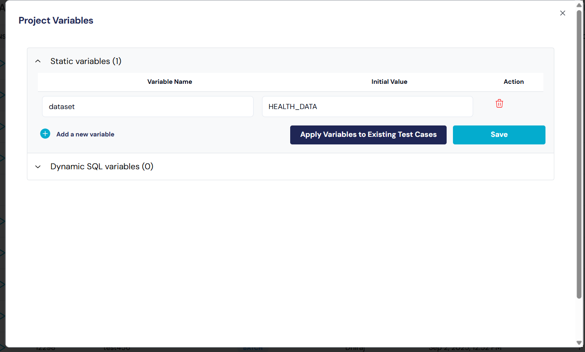

# Reports

## _**User Reports**  -_&#x20;

_Vexdata allows users to generate report for the test cases (selected)_&#x20;

<figure><figcaption></figcaption></figure>

## _**Admin Reports (Manager Report)**  -_&#x20;

VexData allows admin to view progress report that provides the details of the progress of a project, user or Test Cases. It includes updates on completed tasks, ongoing work, upcoming activities, and any issues or risks that might affect the project's timeline or objectives. VexData allows admin to view progress report that provides the details of the progress of a project or task. It includes updates on completed tasks, ongoing work, upcoming activities, and any issues or risks that might affect the project's timeline or objectives.

<figure><figcaption></figcaption></figure>
