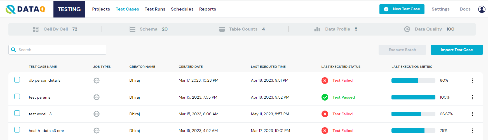
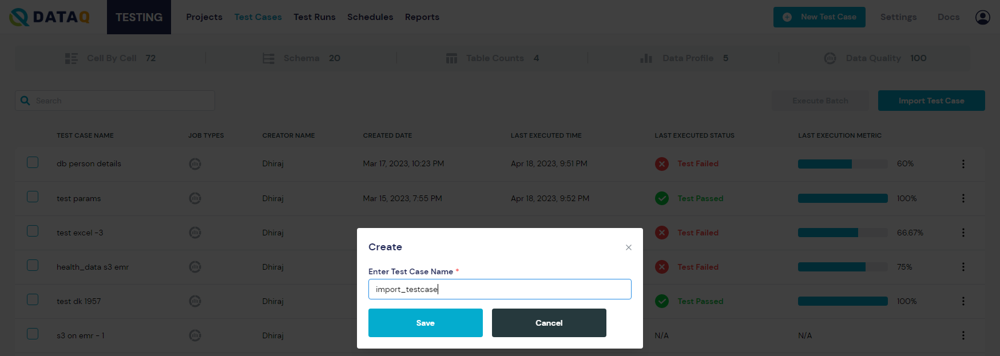
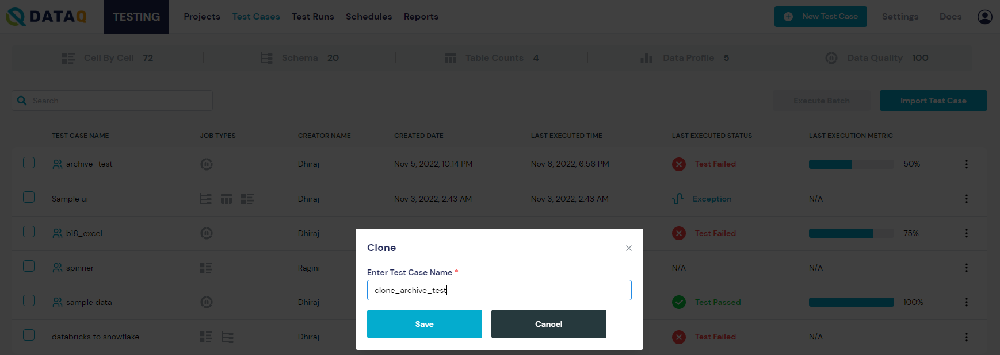
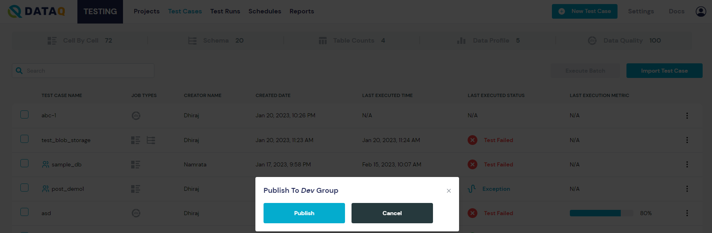

# Test Case

The \_Test Cases\_page displays all the user-saved and executed flows.

<figure><figcaption><p>Test Cases</p></figcaption></figure>

Some important features of this page are:

* \*\*Search: \*\*Allows users to search in the displayed test cases for a specific test case by Test Case _Name_, _Job Type_, _Creator Name_, _Created Date_, _Last Executed Time,_ or _Last Executed Status._
* \*\*Import Test Case : \*\*This feature permits users to upload a JSON file with information to create a Test Case. To do this, follow these instructions:
  * Click on the _Import_ Test Case button which is located above the table, to the right.
  * Find and select the JSON file to be imported from your documents.
  * Click on _Save_ to import the Test Case under the Test Cases table.
  * Click on _Cancel_ to stop the import process.
  * A message is displayed to inform the user that the Test Case has been successfully imported.
* The Test Cases ' list can be sorted by clicking on the columns' titles, i.e., Test Case_Name,     Job Type, Creator Name, Created Date, Last Executed Time,_ and _Last Executed Status._

<figure><figcaption><p>Import Test Case</p></figcaption></figure>

Each Test Case under the _Action_ column has seven available actions, which can be accessed by clicking on the three-dots icon next to the check box. These actions are:

```
   **1. Edit**  - By clicking on this action the system redirects the user to the edit c
   anvas of this particular test case, and can then modify it. 
```

<figure><figcaption><p>Edit Test Case</p></figcaption></figure>

\*\* 2. Clone - \*\*By clicking on this action a user can duplicate the corresponding Test Case :

* Select the _Clone_ option.
* Provide the Test Case's name.
* Click on _Save_ to clone the Test Case .

<figure><figcaption><p>Clone Test Case</p></figcaption></figure>

\*\* 3. Delete - \*\*This action allows the user to delete the selected Test Case .

\*\* 4. Rename - \*\*This action is used to rename the selected Test Case .&#x20;

&#x20;       To rename a Test Case :

* Select the\_ Rename\_ option.
* Modify the Test Case's Name.
* Click on Save\_ to rename the Test Case.

\*\* 5. Export - \*\*This action can be used to download selected Test Case as a JSON file.

\*\* 6. Publish - \*\*This action is used to share the selected Test Case to all the users in that group. A test case belongs only to the user that created it until the user has published the test case.

&#x20;   To publish a Test Case :

* Select a Test Case to publish.&#x20;
* Click on\_ Save\_ to publish the Test Case.


<figure><figcaption><p>Publish Test Case to a Group</p></figcaption></figure>
