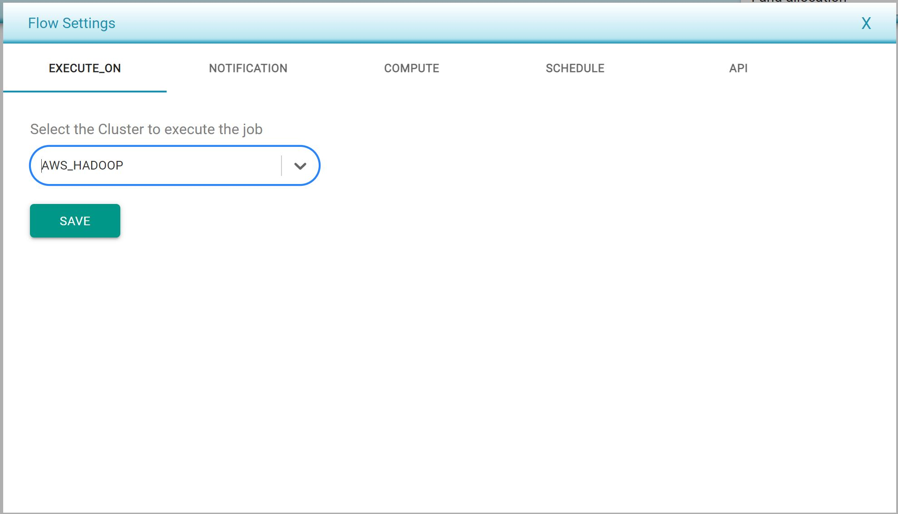

# Defining Flow Settings

* Flow settings can be defined in a per-flow basis.
* Following are the flow settings which can be set at flow level. Users can access these settings by clicking on the three-slider bar icon on the top-right of the screen, nest to the _Result_ button.
  * **Execute\_on** is a setting used to specify where this flow will be executed. A list of server cluster managers is provided in the dropdown menu, and it can be set to an AWS environment, Databricks, or on the local server.

* **Notification** is a setting that can be used to receive an email notification when the test case is completed with the result of the test case. This tab allows users to set the email destination for the notification, and more than one email can be set. 
* **Compute** is a setting that allows users to specify the number of _Threads_ and _Memory_  that will be allocated to run this flow. 
* **Schedule** is a setting that can be used to set the schedule on which this flow will be executed. 

