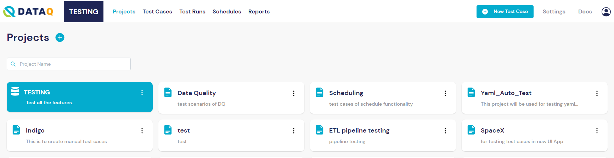
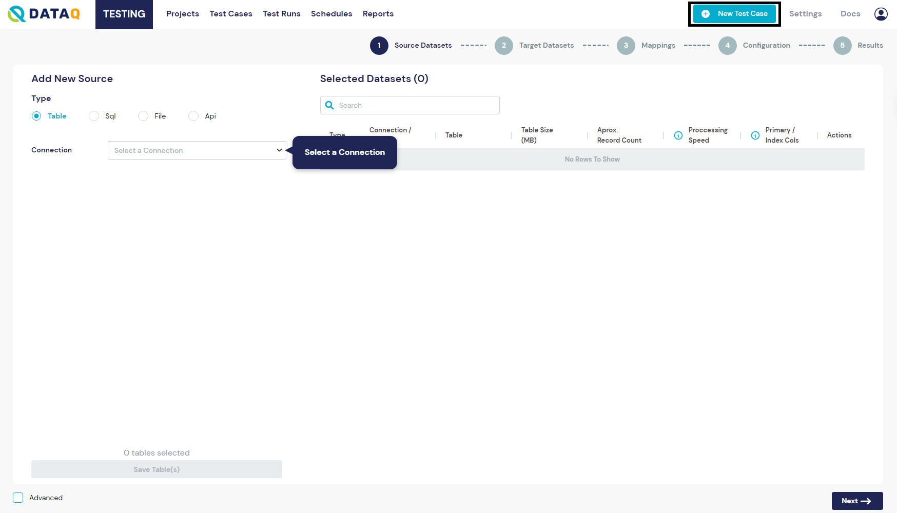
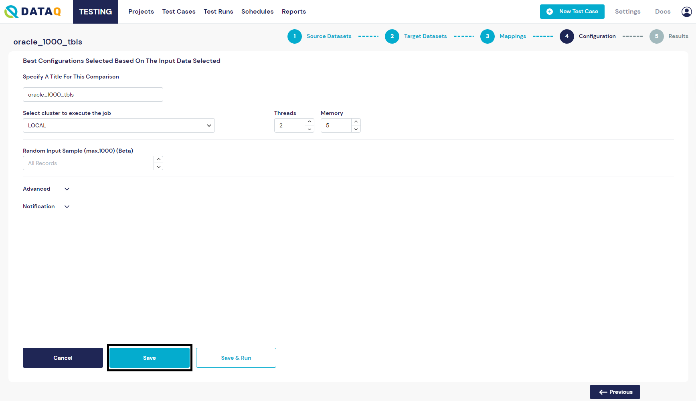

# Create Test Cases

## Select a project by clicking on the project.

<figure><figcaption>
Select Project
</figcaption></figure>

## Create a new test case.

To create a new flow, click on the circular _Plus_ icon visible on the top-right of your screen, next to the name of the currently logged-in user. After clicking on this button, a white canvas will open, with the action's palette visible on the left edge.

<figure><figcaption>
New Test Case
</figcaption></figure>

## Save the test case

After Configuring all the components in the flow, provide a proper name and Save the flow. The message shows “Flow Successfully Submitted”.

<figure><figcaption>
Save Test Case
</figcaption></figure>

## Execute the test case.

After Saving the flow, click on the "Execute" to start execution of the flow.

<figure><figcaption>
Execute Test Case
</figcaption></figure>
