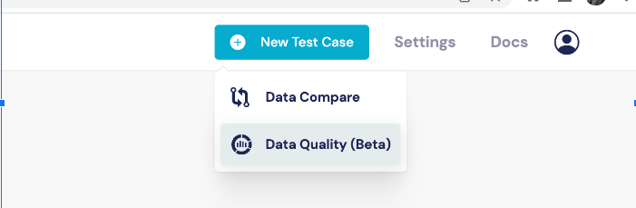
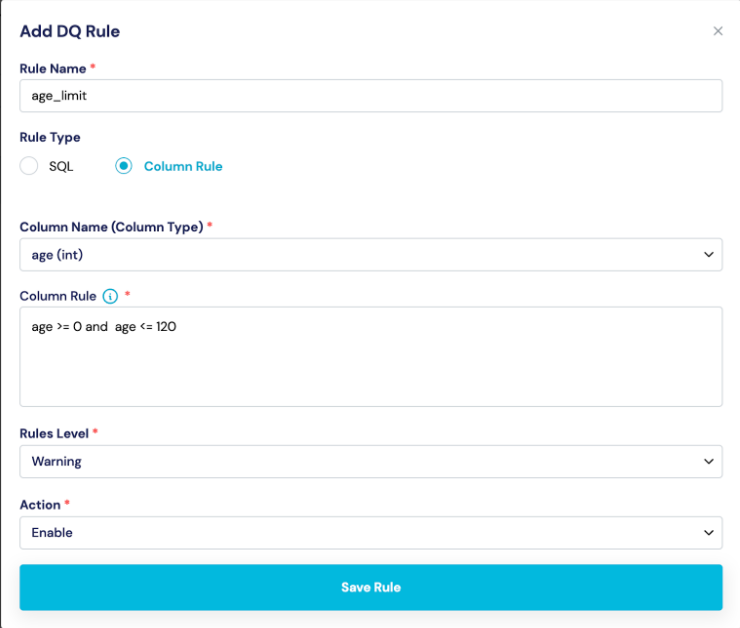

# Data Quality

## Source/Target-only validation:

Target-only validation, as the name suggests, focuses solely on validating the data in the target system without comparing it to a source system. This type of validation is useful when there is no direct source system available for reconciliation or when performing an initial data load into a new system. This document describes how to write source/target only data quality rules.

## Writing data quality rules:

Data quality rules are a set of predefined criteria or conditions that data must adhere to in order to be considered valid and of high quality. These rules help identify and flag any data that doesn't meet the specified standards. When writing data quality rules, you define conditions that the data should satisfy, such as format, data type, range, uniqueness, and referential integrity. By implementing and executing these rules, you can detect and address data quality issues and ensure the accuracy and reliability of the data.

It's important to note that the specific approaches and tools used for data testing, source target reconciliation, and target-only validation can vary depending on the context and the technology stack involved.

Click “New Test Case and Data Quality” as shown in the screenshot. DataQ.io supports two types of data quality rules and they are&#x20;

* Column level&#x20;
* Generic SQL&#x20;

<figure><figcaption>
Select Data Quality
</figcaption></figure>

**`Column level`**&#x20;

`Some examples of column level rules are`

`1. age >= 0`

`2. age >=0 and age <= 130`

`3. account_type = "Checking" and Balance > 100`

In the third example we have an "account\_type" column and a "balance" column, and we want to enforce a rule where if the account type is "checking," the balance should be greater than 100.

<figure><figcaption>
Add a rule
</figcaption></figure>

Note : All the column level rules are executed in one scan to improve execution performance.&#x20;

\
**Generic SQL**

Generic SQL is powerful and gives you more control in writing data quality rules. The output records of the sql are considered as bad records. To select SQL in UI, select SQL radio button in the UI.&#x20;

Let's look at an example with sample data to understand how to write sql rules.&#x20;

Note : It is NOT recommended to use SQL for column level rules as Column level rules are optimized to be executed in single scan while each SQL statement is executed independently and performance depends on each statement.&#x20;

\
\

\
