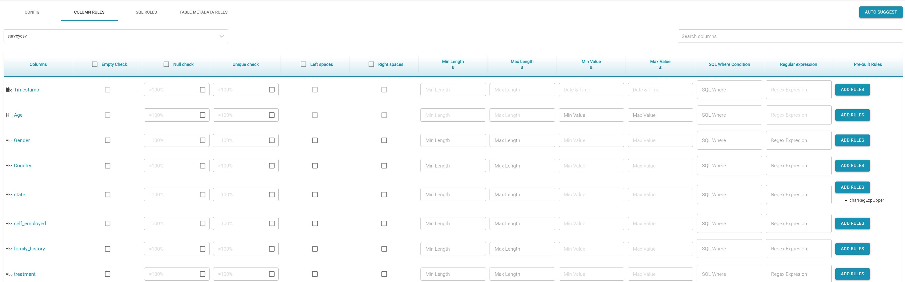

# Data Quality

The _Data Quality_ shape is used to validate input data against rules which are defined by the user.

* There are four tabs to configure the _Data Quality_ shape:
  * **Config**
    * When the _Data Profile_ checkbox is checked, the flow will validate the data profile of the input data against the profile created during the flow creation.
    * The _Import Rules_ and E_xport Rules_ options on this tab can be used to import or export the user-defined rules. 
  * **Column rules**
    * This tab is used to define any conditions/rules at column level manually. What follows are the different rules which can be defined at the column level:
      * Empty check rule : Rule to create a test case which checks if the column is empty. If the checkbox for this rule is checked, during execution of the flow if the corresponding column has empty value in any row during the execution of the flow, this test case will have failed. 
      * Null check rule : This rule will pass during execution if the percentage of number of not nulls in this column falls below the defined threshold.
      * Unique check :  This rule will pass during execution if the percentage of number of unique values in this column falls below the defined threshold.
      * Left/Right spaces: _Upcoming Information_
      * Min length: This rule will pass if all the values in the column are more than the defined minimum length.
      * Max length: This rule will pass if all the values in the column are less than maximum length.
      * Min value: This rule will pass if all the values in the column are more than the defined minimum value.
      * Max value: This rule will pass if all the values in the column are less than defined maximum value.
      * SQL: An _SQL_ expression can be used to check if all rows satisfy this column's condition. If one of the rows fails to satisfy the condition, the test case will have failed.
      * Regular expression : This builds a test case where in a given column, every value of the corresponding column should comply with the regular expression.
      * Prebuilt rules : Prebuilt rules can be added to apply at column level of each row. If any of the rows does not satisfy the condition of the prebuilt rule, the test case will have failed.


The above mentioned rules under _Column Rules_ will be auto-suggested by the system, except for _SQL_. Once the rules are auto suggested,  the user can edit them to customize specific scenarios.


* **SQL Rules** : 
  * This tab can be used to define more than one test case with one _SQL_ rule creating one test case.
  * The result of the _SQL_ rule query should return zero rows for test case pass criteria. If one or more rows are returned, the test case is considered to have failed.
  * Each _SQL_ rule can be a complex query involving one or more tables from the source, if the input is database.
  * If the source is defined as a file, then the _SQL_ rule can contain only one table, the name of which will be a concatenation of the name of the file and its extension.
* **Table Metadata Rules**
  * Minimum record count: This will define a test case which will check for a minimum record count during each input validation process, and will fail if the record count received is less than the defined threshold.
  * Maximum record count : This will define a test case which will check for a maximum record count during each input validation process, and will fail if the record count received is more than the defined threshold.
  * Column name : When this option is checked, a test case will be created which checks if the column names are changed with reference to column names when the original flow is created.
  * Data types : This option, when checked, will create a test case which will be evaluated during each execution. checking if the datatypes of the elements are changed. 
    * Note : This option is always available for table input and _SQL_ input and cannot be selected if the _InferSchema_ option is not selected in the file input.
  * New columns : This column, when checked, will create test cases to be evaluated for the presence of more columns than when the flow is created.
  * Removed columns : This column, when checked, will create test cases to be evaluated for the presence of fewer columns than when the flow is created.

