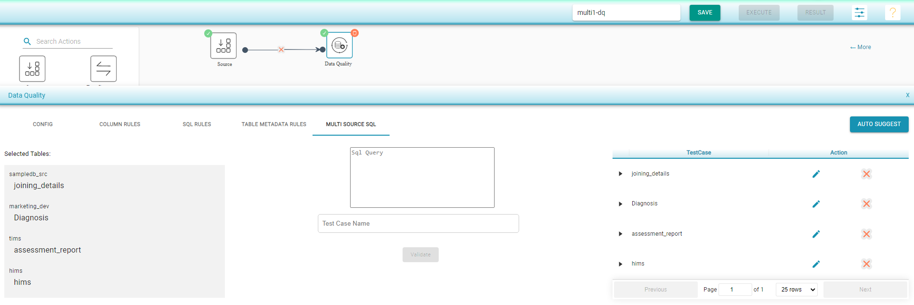

# Multi Source SQL

* This tab is used to create test cases based on sources from multiple connections. These multi-connections can be any combination of:
  * _SQL_ connections 
  * file connections 
  * _API_ connections.
* As with the _SQL_ rules tab, the test case is considered as passed when the query defined in this tab does not return any results, i.e., it checks for the negation condition.
* Any number of queries can be defined, which will in turn create a test case for each defined query.

To select one or more input sources :

* Click on any of the input sources.
* Select the connection and corresponding database.
* Select the desired tables. 
* Click on _Add Selected._
* Select another input source and repeat the above steps.
* Drag the _Data Quality component_ and join the connections.
* Select the _Data Quality_ component and click on _Multi Source SQL._
* User can enter _SQL_ queries on the selected tables. 
* Enter the _Test Case Name_ and click on _Validate._
* The validated queries are shown on the right panel and the user has an option to edit/remove the query.
* Save and Execute the flow.

 

