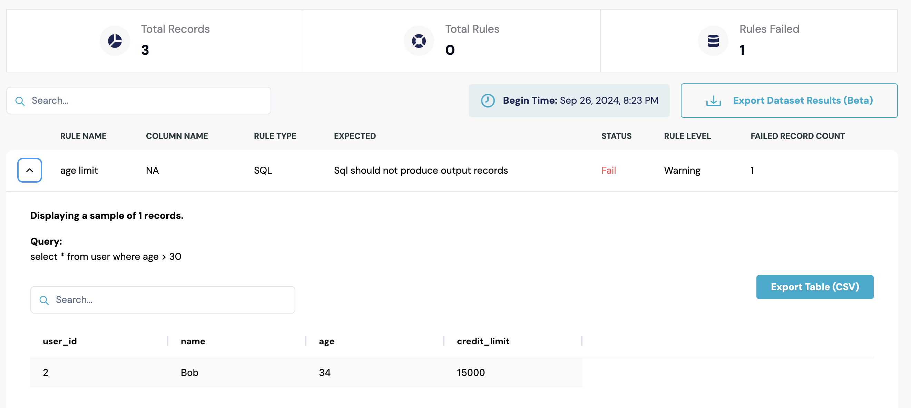

# SQL Rules

## SQL Data Quality Rules - Positive and Negative Conditions

With this new feature, users can now define both **positive** and **negative** SQL data quality conditions to validate their data more effectively.

### Key Features:

1.  **Negative Conditions**:

    * Users can write SQL queries and select an option from a drop-down indicating that **the SQL should not produce any results (default option)**.&#x20;
    * This is useful for ensuring that certain data conditions do not occur in the dataset (e.g., no records should have a value below 0 in a specific column).

    \

2. **Positive Conditions**:
   * Users can write SQL queries and select an option from a drop-down indicating that **the SQL should produce results**, with the following options:
     * The result count should be greater than 0.
     * The result count should be equal to a **fixed value** (e.g., exactly 10 results).
   * This allows users to confirm that certain data conditions are met (e.g., at least one record exists with a specific condition).

### Example Use Cases:

<div><figure><figcaption></figcaption></figure> <figure><figcaption></figcaption></figure></div>

*   **Negative Condition**: Write SQL to ensure no invalid ages in a dataset, such as:

    ```sql
    SELECT * FROM users WHERE age < 0 OR age > 150;

    ```
*   **Positive Condition**: Write SQL to ensure valid ages in a dataset, This should return results:

    ```sql
    SELECT * FROM users WHERE age >= 0 OR age < 150;

    ```


## Write SQL rule or Plain English to generate SQL Rule


<figure><figcaption></figcaption></figure>

Write the test case in English in the **AI Prompt** section and click on Generate SQL.&#x20;



Ensure that all the tables required for this test case are selected in the source section. This is necessary to generate SQL from English.


<figure><figcaption></figcaption></figure>


Below are examples to guide you in creating effective test cases for both single-table and multi-table test scripts.

#### Sample Data

1.  **Users Table**

    | user\_id | name    | age | credit\_limit |
    | -------- | ------- | --- | ------------- |
    | 1        | Alice   | 25  | 5000          |
    | 2        | Bob     | 34  | 15000         |
    | 3        | Charlie | 29  | 7000          |


2.  **Orders Table**

    | order\_id | user\_id | order\_amount | order\_date |
    | --------- | -------- | ------------- | ----------- |
    | 101       | 1        | 300           | 2024-01-15  |
    | 102       | 2        | 2200          | 2024-01-18  |
    | 103       | 1        | 450           | 2024-02-05  |


#### English Inputs and Corresponding SQL

1.  **Validate that no users are underage**

    * **Rule**: Ensure that all users are at least 18 years old in users table
    *   **SQL**:

        ```sql
        SELECT * FROM Users WHERE age < 18;
        ```


    **Result :** [<mark style="color:green;">**Pass**</mark>](#user-content-fn-1)[^1]
2. **Validate that no users are beyond retirement age**
   * **Rule**: Check that no user is older than 30 in Users table.
   *   **SQL**:

       ```sql
       SELECT * FROM Users WHERE age > 30;
       ```


<figure><figcaption></figcaption></figure>

* **Result:&#x20;**<mark style="color:red;">**Fail**</mark>
* **Failed Record Count = 1**

1. **Validate that all users have a positive credit limit**
   * **Rule**: Confirm that every user has a credit limit greater than zero in users table.
   *   **SQL**:

       ```sql
       SELECT * FROM Users WHERE credit_limit <= 0;
       ```

       **Result: Pass**
2. **Ensure total orders do not exceed credit limits**
   * **Rule**: Validate that the sum of order amounts for each user in Orders table does not exceed their credit limit in Users table.
   *   **SQL**:

       ```sql
       SELECT u.user_id, u.name, SUM(o.order_amount) AS total_orders, u.credit_limit
       FROM Users u
       JOIN Orders o ON u.user_id = o.user_id
       GROUP BY u.user_id
       HAVING SUM(o.order_amount) > u.credit_limit;
       ```

       **Result: Pass**
3. **Check for active users with no orders.**
   * **Rule**: Identify users in users table who have not placed any orders.
   *   **SQL**:

       ```sql
       SELECT u.user_id, u.name
       FROM Users u
       LEFT JOIN Orders o ON u.user_id = o.user_id
       WHERE o.order_id IS NULL;
       ```

These examples provide a clear demonstration of how English test case inputs can be translated into SQL queries to validate data across different scenarios in a database system.



Do not include a LIMIT clause in your SQL queries. The engine automatically applies a LIMIT operation to retrieve sample data. For failure counts, the full query is executed as a subquery to accurately calculate the number of failed records.


[^1]: 
