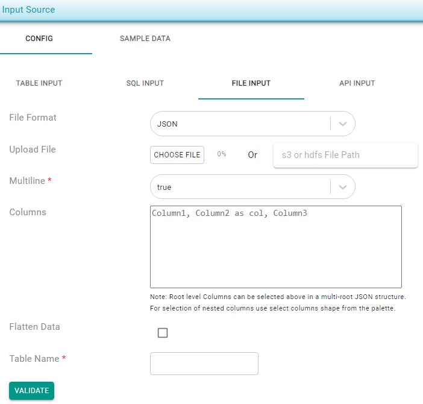

# JSON

JSON files can be used as data input by uploading a file, specifying an _s3_ path \(**s3a**://&lt;file\_path&gt;\), or providing an HDFS location. 

* Multiline options can be set to false if the JSON structure is in single line. Default value for this is set to _True._
* JSON can be flattened, by checking the _Flatten Data_ checkbox, if the JSON structure is in hierarchical format. 
* JSON elements can be selected by specifying element names in the columns section and can be renamed using them as keywords. E.g. if _id_, first\__name_ and _last\_name_ are the only three elements to be selected from a JSON with many distinct elements: _isbn_ as _id, author.firstName_ as _first\_name_ and  _author._lastName as last\_name.

Multi-line _False_ sample:

```text
{ "isbn": "123-456-222","lastname": "Doe","firstname": "Jane"}
{"isbn": "123-456-777","lastname": "Smith","firstname": "Jane"}
```

Multi-line _True_ sample:

```text
[
	{ "isbn": "123-456-222","lastname": "Doe","firstname": "Jane"},
	{"isbn": "123-456-777","lastname": "Smith","firstname": "Jane"}
]
```





Root level columns can be selected above in a multi-root JSON structure. For selection of nested columns, use the _Select Columns_ shape from the palette.


