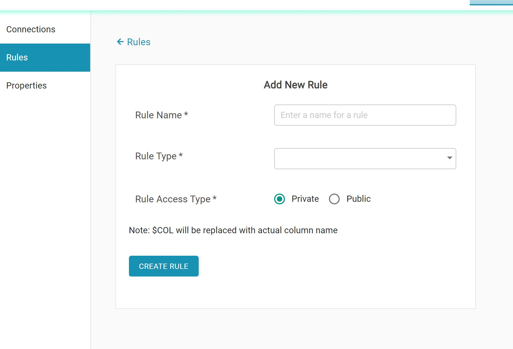

# Settings

* Settings tab is used to create connections, and also to create custom validation functions.
* The connections created by a user will be visible to all users in that group to which the current user belong to.
* The _Connections_ tab will show all the available connections, and permits to add new connections.

* The _Rules_ tab shows a list of all custom rules created by the user and includes the ability to add new rules.
* New rules can be created by clicking on _Add New Rule_. 
* Rules defined here can be used at column level in the SQL rules tab in the _Data Quality_ component.
* _Rule Type_ can be a regular expression or an SQL w_here_ condition.

*  The _Properties_  tab includes several software properties, which are explained in the _Post Installation Setup_ section.

