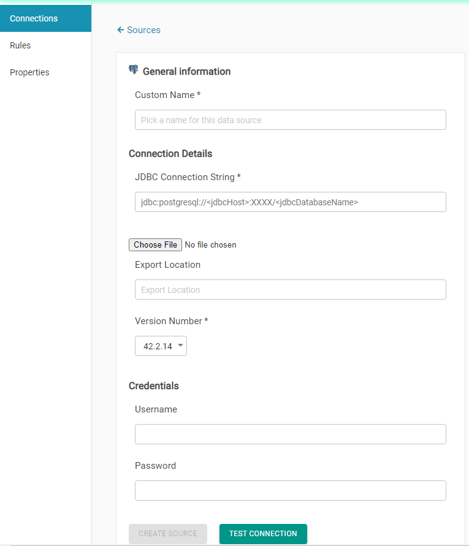

# Postgres

To add an PostgresSQL connection, you will have to provide:

* Connection name, which you will assign to this connection for internal use.
* A JDBC URL. A sample JDBC URL is shown under this text.

> jdbc:postgresql://&lt;jdbcHost&gt;:XXXX/&lt;jdbcDatabaseName&gt;

* Credentials, which will be a username and a password that will provide access to this database.

If SSL is enabled, additional parameters will be required for the JDBC URL as shown under this text. 

> jdbc:postgresql://&lt;jdbcHost&gt;:XXXX/&lt;jdbcDatabaseName&gt;&ssl=true**&sslmode=require&sslfactory=org.postgresql.ssl.NonValidatingFactory**

