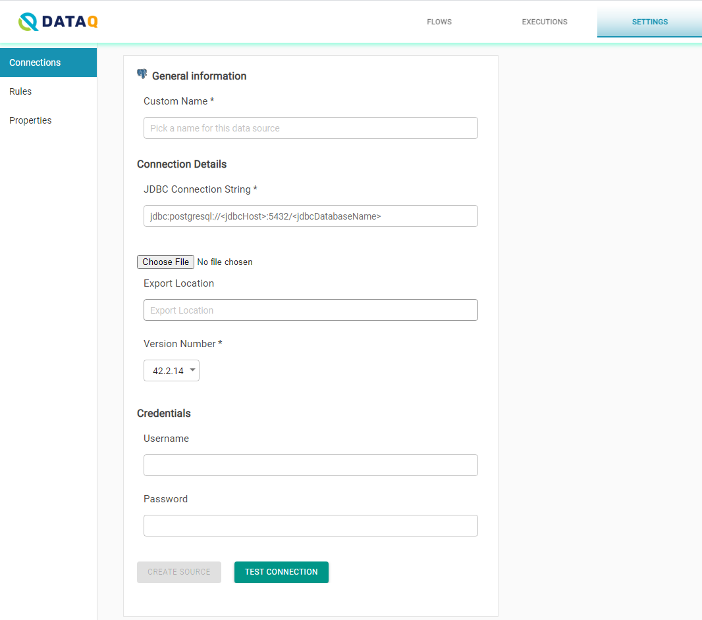

# Databases/Warehouses

Some of the databases and warehouse available when clicking on _Add New Connection_ might require more information than the one shown in the previous section, or could have extra options.

## Redshift

To add a Redshift connection, you will have to provide:

* Connection name, which you will assign to this connection for internal use.
* A JDBC URL. A sample JDBC URL is shown under this text.

> jdbc:redshift://redshift-cluster-1.XXXXXXXXXX.us-east-1.redshift.amazonaws.com:5439/dev?ssl=false

* Credentials, which will be a username and a password that will provide access to this database.

Optionally, you may provide _s3TempDir_ and _s3AwsIamRole_ for better performance, as explained in the following link.



> **s3TempDir**
>
> s3n://**\<S3\_Bucket>**/
>
> **s3AwsIamRole**
>
> arn:aws:iam::**XYZ**:role/Redshift\_Role


It is recommended to create a read only user account in Redshift. The user id needs to have access to the following system tables to read the metadata of all the tables.&#x20;

1. svv\_table\_info
2. information\_schema.views

## SQL Server

To add an SQL Server connection, you will have to provide:

* Connection name, which you will assign to this connection for internal use.
* A JDBC URL. A sample JDBC URL is shown under this text.

> jdbc:sqlserver://XXXXXX:1433;databaseName=XXXXXXX;

* Credentials, which will be a username and a password that will provide access to this database.


It is recommended to create a read only user in Sql Server. The read only user id should have read only access on the databases/schemas where data resides and also have access to the following system tables to read the metadata of all the tables.&#x20;

1. sys.objects&#x20;
2. sys.columns&#x20;
3. sys.types&#x20;
4. sys.indexes&#x20;
5. sys.index\_columns&#x20;
6. sys.columns&#x20;
7. sys.key\_constraints&#x20;
8. sys.tables&#x20;
9. sys.all\_columns


## Postgres

To add a PostgresSQL connection, you will have to provide:

* Connection name, which you will assign to this connection for internal use.
* A JDBC URL. A sample JDBC URL is shown under this text.

> jdbc:postgresql://\<jdbcHost>:XXXX/\<jdbcDatabaseName>

* Credentials, which will be a username and a password that will provide access to this database.

If SSL is enabled, additional parameters will be required for the JDBC URL as shown under this text.

> jdbc:postgresql://\<jdbcHost>:XXXX/\<jdbcDatabaseName>\&ssl=true\*\*\&sslmode=require\&sslfactory=org.postgresql.ssl.NonValidatingFactory\*\*




#### Create a new read only user for Postgres Testing

The user id should only have read permission on the data. Also, DataQ needs permission to read metadata. The user id should have read only permissions on the following system tables

```
pg_class
information_schema.table_constraints
information_schema.columns
pg_namespace
pg_catalog
```


## Snowflake

To add a Snowflake connection, you will have to provide:

* Connection name, which you will assign to this connection for internal use.
* A JDBC URL. A sample JDBC URL is shown under this text.

> jdbc:snowflake://XXX72530.us-east-1.snowflakecomputing.com/?db=\<jdbcDatabaseName>\&schema=\<schemaName>

* Credentials, which will be a username and a password that will provide access to this database.

.png>)

It is recommended to create a read only user account in Snowflake. The user id needs to have access to the following system tables to read the metadata of all the tables.&#x20;

1. information\_schema.columns
2. information\_schema.tables

## Oracle <a href="#snowflake" id="snowflake"></a>

It is recommended to create a read only user account in Oracle. The user id needs to have access to the following system tables to read the metadata of all the tables.&#x20;

1. sys.dba\_tables
2. sys.dba\_constraints
3. sys.dba\_cons\_columns
4. sys.all\_users
5. all\_ind\_columns
6. all\_indexes
7. all\_cons\_columns
8. all\_constraints

## **Maria**​

It is recommended to create a read only user account in Maria. The user id needs to have access to the following system tables to read the metadata of all the tables.&#x20;

1. information\_schema.tables&#x20;
2. information\_schema.columns&#x20;
3. information\_schema.table\_constraints&#x20;
4. information\_schema.key\_column\_usage&#x20;
5. information\_schema.referential\_constraints&#x20;
6. information\_schema.statistics

## DB2

It is recommended to create a read only user account in DB2. The user id needs to have access to the following system tables to read the metadata of all the tables.&#x20;

1. syscat.tables&#x20;
2. syscat.columns&#x20;
3. sysibmadm.admintabinfo&#x20;
4. syscat.tabconst&#x20;
5. syscat.keycoluse

## Bigquery

It is recommended to create a read only user account in Maria. The user id needs to have access to the following system tables to read the metadata of all the tables.&#x20;

1. INFORMATION\_SCHEMA.SCHEMATA&#x20;
2. INFORMATION\_SCHEMA.TABLES&#x20;
3. INFORMATION\_SCHEMA.COLUMNS
