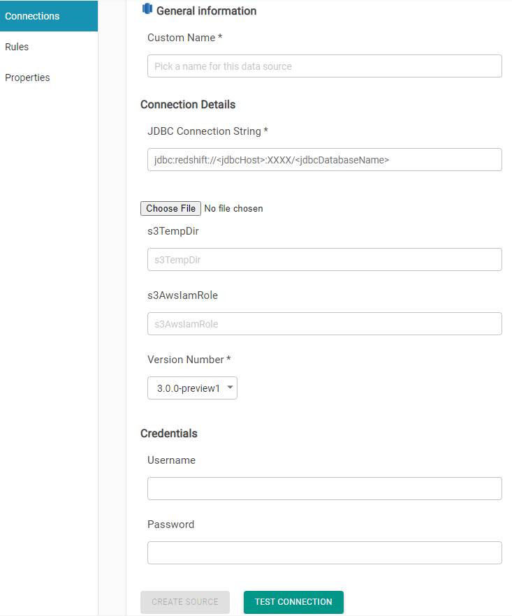

# Redshift

To add a Redshift connection, you will have to provide:

* Connection name, which you will assign to this connection for internal use.
* A JDBC URL. A sample JDBC URL is shown under this text.

> jdbc:redshift://redshift-cluster-1.XXXXXXXXXX.us-east-1.redshift.amazonaws.com:5439/dev?ssl=false

* Credentials, which will be a username and a password that will provide access to this database. 

Optionally, you may provide _s3TempDir_ and _s3AwsIamRole_ for better performance. 

\([https://awsdba.cloud/2019/05/10/redshift-iam-role-for-copy-unload-to-s3/](https://awsdba.cloud/2019/05/10/redshift-iam-role-for-copy-unload-to-s3/)\)

> **s3TempDir**
>
> s3n://**&lt;S3\_Bucket&gt;**/
>
> **s3AwsIamRole**
>
> arn:aws:iam::**XYZ**:role/Redshift\_Role

