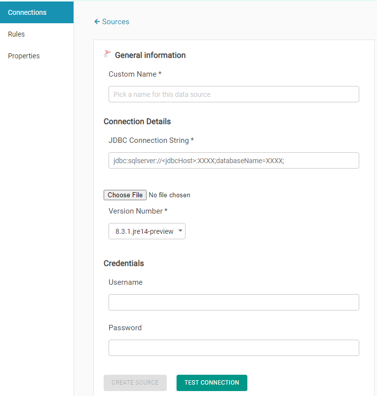

# SQL Server

To add an SQL Server connection, you will have to provide:

* Connection name, which you will assign to this connection for internal use.
* A JDBC URL. A sample JDBC URL is shown under this text.

> jdbc:sqlserver://XXXXXX:1433;databaseName=XXXXXXX;

* Credentials, which will be a username and a password that will provide access to this database. 

