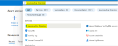

# Active Directory Integration Using Azure

This section includes the steps to register DataQ software in Azure via App Registration. App registration is required so that DataQ software can authenticate with Azure Active Directory to provide Azure users access to DataQ.

### Sign in to the Azure Portal: [https://portal.azure.com/](https://portal.azure.com/) to add DataQ Software

#### Go to App Registration

* Type Azure Active Directory in the Search Bar
* Click on Azure Active Directory

* Click App registration on the left pane

.png>)

#### Register DataQ App

* Click New registration

.png>)

* Name: Type Name of the App – exp. dms-authorizer.
* Supported Account types: Select Accounts in this organizational directory only (Default
* Directory only: Single tenant.
* Redirect URI (Optional):
* Select a platform – Web
* Value - [http://localhost:8081/login/oauth2/code/azure](http://localhost:8081/login/oauth2/code/azure)
* Click Register

.png>)

* Copy the Application (client) ID – This ID will be used in your application\
  settings.

.png>)

#### Create Client Secret

* Click Certificates & secrets in left Pane

.png>)

* Click New client secret

.png>)

* Description: Type Description of the Secret – exp. dms-authorizer
* Expires: Select Set to Custom
* Start: Select the start date
* End: Select date in future till when secret must be valid
* Click Add

.png>)

* Save the value in a safe place as it will not be available later.\
  Click the copy picture

.png>)

### Add the details captured above into app.properties file

* REDIRECT\_URL=https://\<dq.mycompany.com>/login/oauth2/code/azure&#x20;
* TENANT\_ID=\<fbb052b8-qe312-213e3-9be1-e1cae93e0fce>
* CLIENT\_ID=97b448d8-eebb-123d23-9311-e64009db6147
* CLIENT\_SECRET=QWE#\~wd234@#wsdfsdfSdfKx288y2Q4H2fNmxyBMaUF

\
