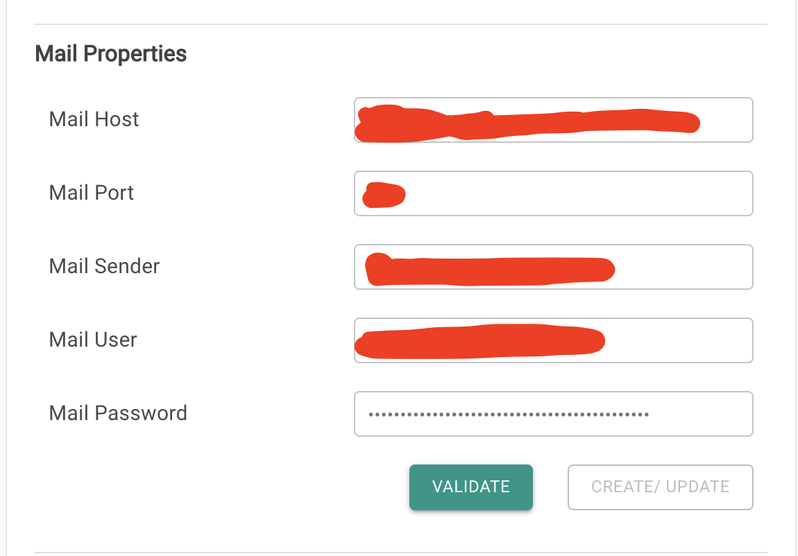
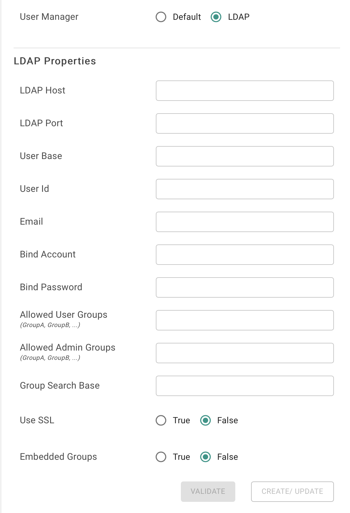

# Post Installation Setup

This interface can be accessed by going to _Settings --&gt; Properties,_ where the following details can be entered.

## Setup Email Server

To setup the email server, you will have to provide the following information.

## Setup Server Default Time Zone

The default time zone can be changed by selecting your choice from the drop-down list that is located under "Default Timezone".

## Setup LDAP

1. Select the LDAP option in the "User Manager" section, under "Authentication Manager". 
2. Fill up all the required details for the LDAP protocol. 
3. Restart the server using _./restart\_server.sh_ for the LDAP changes to take effect.

