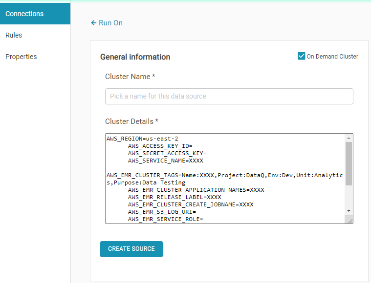

# AWS EMR Cluster on demand

## Create on demand EMR cluster

Configuring on demand cluster enables jobs to leverage EMR cluster on demand. EMR cluster is launched on the fly and terminated on completing the job. 

* AWS\_EMR\_SERVICE\_ROLE=EMR\_DefaultRole 
* AWS\_EMR\_EC2\_SERVICE\_ROLE=EMR\_EC2\_DefaultRole
* AWS\_REGION=us-east-1 
* AWS\_SERVICE\_NAME=elasticmapreduce
* AWS\_EMR\_CLUSTER\_TAGS=Name:Innovacer,Project:DataQ AWS\_NETWORK\_VPC=vpc-0491d5b0ed65ea0f9 
* AWS\_EMR\_CLUSTER\_APPLICATION\_NAMES=Spark,Livy,Hive
* AWS\_EMR\_RELEASE\_LABEL=emr-5.31.0
* AWS\_EMR\_CLUSTER\_CREATE\_JOBNAME=DataQSparkCluster 
* AWS\_EMR\_S3\_LOG\_URI=s3://aws-logs-865515016503-us-east-1/elasticmapreduce/
* AWS\_EMR\_SERVICE\_ROLE=EMR\_DefaultRole
* AWS\_EMR\_EC2\_SERVICE\_ROLE=EMR\_EC2\_DefaultRole 
* AWS\_EC2\_INSTANCE\_SUBNET=subnet-072956387c3bc1383
* AWS\_EMR\_EC2\_MASTER\_INSTANCE\_TYPE=m5.xlarge
* AWS\_EMR\_EC2\_SLAVE\_INSTANCE\_TYPE=m5.xlarge 
* AWS\_NETWORK\_VPC=vpc-0491d5b0ed65ea0f9

> AWS\_REGION=XXXXXX
>
> AWS\_EMR\_CLUSTER\_TAGS=XXXXXX

